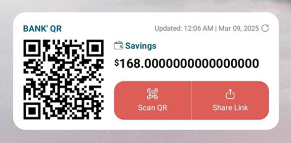
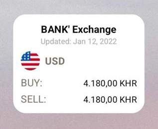

# Android Mobile Banking Widgets

## 📱 Introduction
Android widgets provide quick access to app data on the home screen, allowing users to interact without opening the app. This project showcases various UIs of widgets built using **Kotlin** and **XML-based layouts**.

## 📸 Screenshots
| Widget | Screenshot |
|------------|---------|
| Account Info |  |
| Exchange |  |
| QR |  |

<!--## 🎥 Demo Video-->
<!--[](https://www.youtube.com/watch?v=dQw4w9WgXcQ)-->

## ✨ Features
- 💳 **Account Info** – QR, balance, and refresh button.
- 🔄 **Exchange** – Buy and sell rate.
- 📱 **QR** - Account's QR.

## 📂 Project Structure
```
/android-mobile-banking-widgets
│── app
│   ├── src/main/java/com/example/widgets
│   │   ├── AccountInfoWidgetProvider.kt
│   │   ├── ExchangeRateWidgetProvider.kt
│   │   ├── QRWidgetProvider.kt
│   ├── res/layout
│   │   ├── widget_account_info.xml
│   │   ├── widget_exchange_rate.xml
│   │   ├── widget_qr.xml
│   ├── res/xml
│   │   ├── widget_account_info_info.xml
│   │   ├── widget_exchange_rate_info.xml
│   │   ├── widget_qr_info.xml
│   ├── AndroidManifest.xml
│── README.md
```

## 🚀 Getting Started
1. Clone the repository:
   ```sh
   git clone https://github.com/VatanakChamroeun/android-mobile-banking-widgets.git
   ```
2. Open the project in **Android Studio**.
3. Build and run on a real device or an emulator.
4. Add the widget from the **Home Screen > Widgets Menu**.

## 🔧 Configuration
To customize the widget, modify `res/xml/widget_account_info_info.xml` following the guideline https://developer.android.com/develop/ui/views/appwidgets/layouts:
```xml
<?xml version="1.0" encoding="utf-8"?>
<appwidget-provider xmlns:android="http://schemas.android.com/apk/res/android"
    android:initialLayout="@layout/widget_account_info"
    android:minWidth="276dp"
    android:minHeight="220dp"
    android:maxWidth="553dp"
    android:maxHeight="117dp"
    android:updatePeriodMillis="1800000"
    android:resizeMode="none"
    android:widgetCategory="home_screen|keyguard" />
```

---

Happy Coding! 🚀
